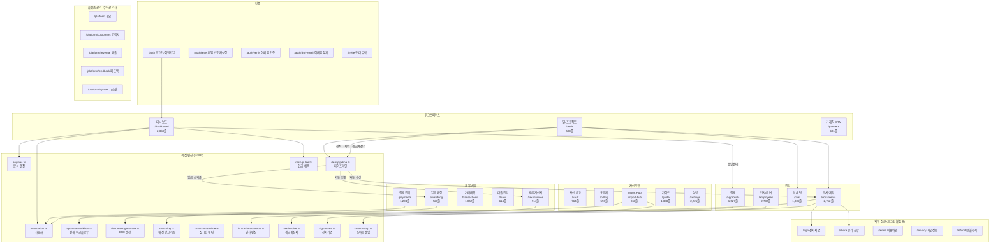
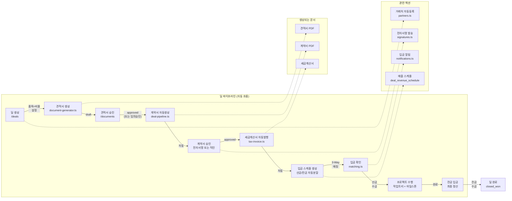

# LeanOS 기능 맵 + 역할별 여정 + 시스템 아키텍처

> 생성일: 2026-03-09 | 프로젝트 경로: `/Users/motive/lean-os/`
> 총 코드: **38,939줄** (페이지 22,957줄 + 라이브러리 15,982줄)
> 페이지: 21개 앱 페이지 + 10개 외부/플랫폼 페이지
> 라이브러리: 49개 엔진/유틸리티

---

## 1. 기능 맵 (Feature Map)

### P0 (Core) -- 매출 직결 기능

| # | 기능명 | 라우트/파일 | 줄 수 | 핵심 기능 | 상태 |
|---|--------|-------------|-------|-----------|------|
| 1 | **대시보드 (생존 현황판)** | `/dashboard` → `dashboard/page.tsx` | 2,363 | - 6-Pack 생존지표 (현금잔고, 번율, 런웨이, 매출채권, 매입채무, 미수금)<br>- Cash Pulse (현금 펄스 점수 0~100)<br>- D+30 / D+90 현금 예측<br>- 역할별 대시보드 (Owner/Admin/Employee/Partner 4종)<br>- 승인센터 위젯 (원클릭 일괄 승인)<br>- 위험 구역 (마진 20% 이하, 미수금 30일+, D-7 마감)<br>- 프리셋 뷰 (재무/운영/커스텀) + 위젯 편집<br>- 월 마감 체크리스트<br>- 자동화 엔진 실행<br>- 엑셀 업로드 → 자동 파싱<br>- 데이터 동기화 (은행/홈택스/카드 연동 요청)<br>- 온보딩 위저드 | Complete |
| 2 | **딜/프로젝트 관리** | `/deals` → `deals/page.tsx` | 508 | - 딜 생성 (B2B/B2C/B2G 분류, 계약금액, 기간)<br>- 3뷰: 테이블/칸반/캘린더<br>- 칸반 드래그앤드롭 (진행중/검토중/완료/실패/휴면)<br>- 딜 상세: 작업 트리 (무한 깊이 WBS)<br>- 매출 스케줄 + 비용 스케줄<br>- 마일스톤 D-day 관리<br>- 서브딜 (외주/파트너)<br>- 담당자 배정 + 아바타<br>- 딜 채팅 (실시간)<br>- **프로세스 파이프라인** (견적서→계약서→세금계산서→입금스케줄→입금완료)<br>- 견적 품목 편집기 + 결제비율 (선금/잔금)<br>- 임의 승인 (업체 미응답 시)<br>- 우선순위/위험도 배지<br>- 분류별/우선순위 필터<br>- 휴면 딜 감지 + 재활성화<br>- 아카이브 | Complete |
| 3 | **문서/계약 관리** | `/documents` → `documents/page.tsx` | 2,762 | - 문서 생성 (빈 문서 / 템플릿 기반)<br>- 문서 타입: 견적서, 계약서, 세금계산서, PI/CI/PL 등<br>- 버전 관리 (리비전 히스토리)<br>- 워크플로우: draft → review → approved → locked → executed<br>- 품목/결제조건 인라인 편집<br>- AI 문서 분류 (자동 분류 배지)<br>- 전자서명 요청 (이름/이메일/전화번호)<br>- 자체 서명 (캔버스 드로잉)<br>- 직인 날인<br>- PDF 생성 (한국어 폰트 내장)<br>- 이메일 공유 (링크 생성 + 발송)<br>- 파일 첨부 (멀티 업로드)<br>- 폴더 관리<br>- 문서 검색 | Complete |
| 4 | **세금계산서** | `/tax-invoices` → `tax-invoices/page.tsx` | 914 | - 매출/매입 세금계산서 관리<br>- 월별 조회 + 기간 필터<br>- 3-Way 매칭 (계약-세금계산서-입금)<br>- 부가세 프리뷰 (월별/분기별/반기별)<br>- 홈택스 엑셀 일괄 임포트<br>- 카드 공제 요약<br>- 엑셀 내보내기<br>- 수동 발행 (거래처명, 사업자번호, 공급가액) | Complete |
| 5 | **결제 관리** | `/payments` → `payments/page.tsx` | 1,294 | - 결제 큐 (대기→승인→실행 3단계)<br>- 급여 일괄 배치 생성<br>- 고정비 일괄 배치 생성<br>- 반복 결제 설정 (자동이체)<br>- 지출결의서/품의서<br>- Smart Setup (은행 거래 패턴 자동 감지 → 반복결제 등록)<br>- 자동화 엔진 (분류 + 매칭 통합 실행)<br>- 결제 통계 (대기/승인/실행 건수) | Complete |
| 6 | **입금 매칭** | `/matching` → `matching/page.tsx` | 521 | - 거래내역-매출스케줄 자동 매칭<br>- 3-Way 매칭 (계약-세금계산서-입금)<br>- 매칭 허용 오차 설정<br>- 매칭 결과 리뷰 + 확정<br>- 입금 확인 → 파이프라인 자동 진행 | Complete |

### P1 (Important) -- 운영 핵심 기능

| # | 기능명 | 라우트/파일 | 줄 수 | 핵심 기능 | 상태 |
|---|--------|-------------|-------|-----------|------|
| 7 | **인사/급여 (HR)** | `/employees` → `employees/page.tsx` | 2,732 | - 8개 탭: 인력관리/급여이력/급여명세/계약서/경비청구/근태/휴가/증명서<br>- 직원 초대 (이메일 → 가입 → 계약 → 재직)<br>- 직원 상세 패널 + 온보딩 진행률<br>- 급여 이력 관리 (연봉/호봉/수당)<br>- 급여 명세 미리보기 (4대보험 자동 계산)<br>- 계약서 패키지 (일괄 전자서명 발송)<br>- 경비 청구 + 승인/반려/지급<br>- 출퇴근 체크인/체크아웃 + 주간 근무시간 집계<br>- 연차/반차/2시간 휴가 + 잔여연차 표시<br>- 연차 촉진 (미사용 연차 알림)<br>- 재직증명서/경력증명서 PDF 생성<br>- Employee 역할은 자기 탭만 접근 | Complete |
| 8 | **결재 관리** | `/approvals` → `approvals/page.tsx` | 1,527 | - 5개 탭: 내 결재함/내 요청/전체 현황/새 요청/정책 관리<br>- 다단계 결재 워크플로우 (1~N단계)<br>- 요청 유형 14종: 경비/결제/초과근무/구매/계약/출장/카드/장비/품의서/지출결의서/휴가 등<br>- 휴가 신청 전용 UI (캘린더/잔여연차/유형별 템플릿)<br>- 자동 승인 (금액 기준 이하)<br>- 결재 정책 CRUD (유형별 결재 흐름 설정)<br>- 타임라인 (세로/가로 시각화)<br>- 첨부파일 업로드<br>- 반려 후 재제출<br>- 승인/반려 코멘트 | Complete |
| 9 | **거래처 CRM** | `/partners` → `partners/page.tsx` | 631 | - 거래처 등록 (Vendor/Client/Partner/Government/Other)<br>- 360도뷰: 기본정보/딜/결제/문서 4탭<br>- 복합 검색 (이름+담당자+이메일+사업자번호)<br>- 태그 필터링<br>- 활성/비활성 토글<br>- 은행 정보 관리<br>- 엑셀 내보내기<br>- 딜에서 거래처 자동 생성 | Complete |
| 10 | **거래내역** | `/transactions` → `transactions/page.tsx` | 1,052 | - 은행 거래내역 관리 (Inbox/전체/규칙/카드 4탭)<br>- 자동 분류 (규칙 기반 매핑)<br>- 수동 매핑 (딜/분류 연결)<br>- 법인카드 관리 (등록/한도/거래내역)<br>- 영수증 업로드 (카드별)<br>- 분류 규칙 관리 (패턴 매칭)<br>- 통계 (미매핑/자동매핑/수동매핑/무시) | Complete |
| 11 | **팀 채팅** | `/chat` → `chat/page.tsx` | 1,306 | - 딜 연결 채팅 / 팀 채널 / DM<br>- 실시간 메시지 (Supabase Realtime)<br>- 무한 스크롤 (50건씩 페이지네이션)<br>- 메시지 수정/삭제<br>- 답장 (Reply to)<br>- 리액션 (이모지)<br>- 멘션 (@)<br>- 파일 첨부<br>- 메시지 고정<br>- 채널 내 검색<br>- 참가자/이벤트/파일 탭<br>- 외부 초대 (초대 링크 생성)<br>- 읽음 처리 + 안 읽음 배지 | Complete |
| 12 | **전자서명** | `/sign` → `sign/page.tsx` | 외부 | - 토큰 기반 서명 페이지 (로그인 불필요)<br>- 캔버스 드로잉 서명 / 텍스트 서명 / 저장된 서명 재사용<br>- 계약 패키지 (여러 문서 일괄 서명)<br>- 서명 완료 시 상태 자동 업데이트 | Complete |
| 13 | **문서 공유** | `/share` → `share/page.tsx` | 외부 | - 토큰 기반 공유 링크 (로그인 불필요)<br>- 조회수 기록<br>- 피드백: 승인/보류/반려 + 코멘트<br>- 응답자 정보 (이름/이메일) | Complete |

### P2 (Nice-to-have) -- 품질 향상 기능

| # | 기능명 | 라우트/파일 | 줄 수 | 핵심 기능 | 상태 |
|---|--------|-------------|-------|-----------|------|
| 14 | **사용 가이드** | `/guide` → `guide/page.tsx` | 1,338 | - 인터랙티브 애니메이션 가이드<br>- 카테고리별: 대시보드/딜/문서/결제/인사/거래처/채팅/설정<br>- 커서 애니메이션 + 클릭 시뮬레이션<br>- 모형 UI 요소 (버튼/카드/테이블/차트)<br>- 스포트라이트 하이라이트<br>- 단계별 진행 | Complete |
| 15 | **자산 금고 (Vault)** | `/vault` → `vault/page.tsx` | 764 | - 4개 탭: 계정/자산/문서/자동발견<br>- SaaS 계정 관리 (URL/로그인/월비용/갱신일)<br>- 유형/무형 자산 관리<br>- 라이선스/인증서/계약서/보험 문서 보관<br>- 거래 패턴 자동 발견 (반복 지출 감지)<br>- 파일 업로드 연결 | Complete |
| 16 | **대출 관리** | `/loans` → `loans/page.tsx` | 614 | - 4개 탭: 목록/상환이력/등록/자동매칭<br>- 대출 등록 (기업/한도/시설/정책자금)<br>- 상환 기록 (원금/이자 분리)<br>- 대출 요약 (잔액/이자율)<br>- 은행 거래내역 자동 매칭<br>- 매칭 수락/거부 | Complete |
| 17 | **요금제 관리** | `/billing` → `billing/page.tsx` | 598 | - 4개 탭: 요금제/결제수단/청구서/추천<br>- 4등급: Free/Starter/Business/Enterprise<br>- 월간/연간 결제 주기<br>- 구독 업그레이드/해지<br>- 청구서 목록<br>- 추천 코드 생성 + 공유 | Complete |
| 18 | **설정** | `/settings` → `settings/page.tsx` | 2,225 | - 6개 탭: 일반/회사/결재/계좌/세무/인증서<br>- 잔고/고정비 설정<br>- 은행 계좌 관리 (역할별: 운영/급여/세금/예비)<br>- 비용 라우팅 규칙<br>- 딜 분류 관리 (B2B/B2C/B2G + 색상)<br>- 팀원 초대 (이메일 발송)<br>- 파트너 초대<br>- 세무 설정 (매칭 허용오차 등)<br>- 회사 프로필 관리 | Complete |
| 19 | **데이터 가져오기 (Import Hub)** | `/import-hub` → `import-hub/page.tsx` | 868 | - 드래그앤드롭 파일 업로드<br>- 6유형 자동 감지: 현황판 엑셀/홈택스 세금계산서/플렉스 HR/인수인계/은행 거래/법인카드<br>- 미리보기 → 확인 → 임포트 3단계<br>- 임포트 이력 (최근 10건)<br>- 자동화 엔진 연계 (분류+매칭 즉시 실행) | Complete |
| 20 | **온보딩** | `/onboarding` → `onboarding/page.tsx` | 704 | - 신규 직원 5단계 온보딩 위저드<br>- Step 1: 개인정보 (이름/연락처/주소/비상연락처)<br>- Step 2: 급여 계좌 (은행 선택/계좌번호/예금주)<br>- Step 3: 서류 제출 (이력서/신분증/통장사본/주민등록등본/포트폴리오)<br>- Step 4: 전자서명 (캔버스 드로잉/텍스트 입력)<br>- Step 5: 완료 확인<br>- 온보딩 미완료 시 자동 리다이렉트 | Complete |
| 21 | **플랫폼 관리자** | `/platform/*` | 5개 | - 전체 고객사/구독/매출/피드백/시스템 관리<br>- SaaS 운영 대시보드 (슈퍼 관리자용) | Complete |

---

### 라이브러리 (src/lib/) 상세

| # | 파일명 | 줄 수 | 역할 |
|---|--------|-------|------|
| 1 | `queries.ts` | 1,785 | **핵심 데이터 쿼리** — getCurrentUser, getFounderData, getDeals, getDealWithNodes, buildTree, getBankTransactions, getPaymentQueue, getVaultSummary 등 70+ 함수 |
| 2 | `automation.ts` | 882 | **자동화 엔진** — 은행 거래 분류, 카드 매핑, 3-Way 매칭, 반복결제 탐지, 전체 자동화 실행 |
| 3 | `hr.ts` | 798 | **인사 관리** — 출퇴근, 연차, 급여이력, 근태, 연차촉진, 직원 업데이트 |
| 4 | `approval-workflow.ts` | 766 | **다단계 결재** — 정책 관리, 결재 요청 생성, 단계별 승인/반려, 타임라인 |
| 5 | `document-generator.ts` | 720 | **문서 PDF 생성** — 견적서, 계약서, 세금계산서, PI/CI/PL PDF 렌더링 |
| 6 | `billing.ts` | 667 | **구독/과금** — 요금제 관리, 구독 생성, 청구서 발행 |
| 7 | `deal-pipeline.ts` | 599 | **딜 파이프라인** — 견적→계약→세금계산서→입금 자동 흐름, 임의승인 |
| 8 | `file-storage.ts` | 576 | **파일 관리** — 업로드, 다운로드, 폴더 관리, 검색 |
| 9 | `hr-contracts.ts` | 566 | **계약 패키지** — 계약서 패키지 생성/발송/취소, 전자서명 연동 |
| 10 | `approval-center.ts` | 551 | **CEO 승인센터** — 미결 액션, 일괄 승인, 반복결제 관리, 알림 이메일 |
| 11 | `certificates.ts` | 550 | **증명서 발급** — 재직증명서, 경력증명서 PDF 생성 + 발급 이력 |
| 12 | `chat.ts` | 463 | **채팅 엔진** — 채널 생성, 메시지 발송, 답장, 리액션, 편집, 삭제, 멘션, 초대 |
| 13 | `payment-batch.ts` | 435 | **배치 결제** — 급여/고정비 일괄 배치, 승인 후 실행 |
| 14 | `loans.ts` | 392 | **대출 관리** — 대출 등록/수정/삭제, 상환 기록, 자동 매칭 |
| 15 | `tax-invoice.ts` | 389 | **세금계산서** — 발행, 3-Way 매칭, VAT 프리뷰, 홈택스 파싱, 일괄 임포트 |
| 16 | `engines.ts` | 377 | **분석 엔진** — Founder Dashboard, Financial Dashboard, 위험 분석 |
| 17 | `handover-parser.ts` | 373 | **인수인계 파서** — 인수인계 문서 파싱 → DB 등록 |
| 18 | `smart-setup.ts` | 304 | **스마트 셋업** — 반복거래 탐지, 엑셀 기반 반복결제 설정 |
| 19 | `excel-parser.ts` | 297 | **엑셀 파서** — 현황판 엑셀 파싱 → 월별 재무 데이터 |
| 20 | `signatures.ts` | 244 | **전자서명** — 서명 요청 생성, 상태 관리, 서명 저장, 직인 날인 |
| 21 | `document-sharing.ts` | 231 | **문서 공유** — 공유 링크 생성, 조회 기록, 피드백 수신 |
| 22 | `expenses.ts` | 225 | **경비 관리** — 경비 청구 생성, 승인/반려/지급 |
| 23 | `card-transactions.ts` | 217 | **법인카드** — 카드 등록, 거래내역 조회, 매핑, 영수증 업로드 |
| 24 | `flex-parser.ts` | 214 | **Flex HR 파서** — 플렉스 내보내기 파싱 → 직원 데이터 |
| 25 | `documents.ts` | 212 | **문서 CRUD** — 문서 생성, 리비전 저장, 상태 변경, 잠금 |
| 26 | `cash-pulse.ts` | 207 | **현금 펄스** — 현금 흐름 예측, 펄스 점수 계산 |
| 27 | `auto-discovery.ts` | 206 | **자동 발견** — 거래 패턴 분석, 반복 지출 감지 |
| 28 | `invitations.ts` | 197 | **초대 관리** — 직원/파트너 초대 생성, 이메일 발송, 취소 |
| 29 | `matching.ts` | 192 | **거래 매칭** — 입출금↔매출/비용 스케줄 자동 매칭 알고리즘 |
| 30 | `partners.ts` | 180 | **거래처** — CRUD, 검색, 딜 연동 자동생성 |
| 31 | `notifications.ts` | 173 | **알림** — 인앱 알림 생성, 조회, 읽음 처리 |
| 32 | `pdf-report.ts` | 170 | **PDF 리포트** — 월간 손익보고서 PDF 생성 |
| 33 | `referral.ts` | 168 | **추천 프로그램** — 추천 코드 생성, 적용, 보상 |
| 34 | `payment-queue.ts` | 163 | **결제 큐** — 큐 엔트리 생성, 승인, 거절, 실행, 통계 |
| 35 | `file-detector.ts` | 154 | **파일 유형 감지** — 6종 파일 자동 감지 (엑셀 헤더 패턴 분석) |
| 36 | `realtime.ts` | 140 | **실시간** — Supabase Realtime 채널 구독 (메시지/리액션) |
| 37 | `doc-intelligence.ts` | 130 | **문서 AI** — 문서 자동 분류, 계약 필드 추출, 유형 라벨 |
| 38 | `closing.ts` | 128 | **월 마감** — 체크리스트 생성, 항목 토글, 마감 완료 |
| 39 | `sample-data.ts` | 121 | **샘플 데이터** — 데모용 재무 데이터 자동 생성 |
| 40 | `routing.ts` | 116 | **비용 라우팅** — 비용 유형별 계좌 라우팅 규칙 |
| 41 | `payroll.ts` | 113 | **급여 계산** — 4대보험 공제, 급여 명세 미리보기 |
| 42 | `business-events.ts` | 106 | **비즈니스 이벤트** — 감사 로그 기록 |
| 43 | `search.ts` | 105 | **통합 검색** — 딜/문서/거래처/직원 크로스 검색 |
| 44 | `widget-registry.ts` | 98 | **위젯 레지스트리** — 대시보드 위젯 정의 + 프리셋 뷰 |
| 45 | `archiving.ts` | 89 | **아카이브** — 딜/문서 아카이브 처리 |
| 46 | `audit.ts` | 66 | **감사 로그** — 액션 기록 + 조회 |
| 47 | `excel-export.ts` | 42 | **엑셀 내보내기** — 재무 리포트/드릴다운 엑셀 생성 |
| 48 | `calculations.ts` | 32 | **계산 유틸** — 금액 포맷, 비율 계산 |
| 49 | `supabase.ts` | 7 | **Supabase 클라이언트** — 싱글턴 초기화 |

---

## 2. 역할별 여정 (User Journeys)

### 역할 정의

| 역할 | 코드 | 접근 가능 라우트 | 대시보드 |
|------|------|-----------------|---------|
| **Owner (대표)** | `owner` | 전체 | 생존 현황판 (6-Pack + Cash Pulse + 위험구역 + 재무 드릴다운) |
| **Admin (관리자)** | `admin` | 대부분 (대출/자산 금고 제외) | 관리자 현황판 (승인대기 + 4지표 + 빠른이동) |
| **Employee (직원)** | `employee` | 대시보드/딜/문서/채팅/근태/결재 | 직원 대시보드 (출퇴근 + 내 할일) |
| **Partner (거래처)** | `partner` | 대시보드/딜/문서/채팅/가이드 | 파트너 대시보드 (프로젝트 현황) |

---

### Owner (대표) TOP 5 시나리오

#### 시나리오 1: 대시보드에서 경영현황 확인

```
1. /dashboard 접속
   → 생존 현황판 로드 (6-Pack 생존지표)

2. Cash Pulse 바 확인
   → 통장 잔고, D+30/D+90 예측, 펄스 점수(0~100), 위험/대기 건수

3. 승인센터 위젯 확인
   → 미결 승인(경비/결제/휴가) → 원클릭 일괄 승인 또는 개별 승인/반려

4. 위험 구역 확인
   → 마진 20% 이하 딜, 미수금 30일+, D-7 마감 항목 경고

5. 재무 드릴다운
   → 매출/비용 차트 클릭 → Level 2(분류별) → Level 3(딜별) → Level 4(항목별)

6. 데이터 동기화 버튼
   → 은행/홈택스/카드 데이터 수집 요청 + 자동 분류 엔진 실행

7. 엑셀 업로드 또는 샘플 데이터 생성
   → 현황판 엑셀 파싱 → DB 저장 → 대시보드 자동 갱신
```

**사용 페이지/기능**: `dashboard/page.tsx`, `engines.ts`, `cash-pulse.ts`, `approval-center.ts`, `automation.ts`, `excel-parser.ts`

---

#### 시나리오 2: 딜 생성 → 견적 → 계약 → 세금계산서 → 입금매칭

```
1. /deals → "+ 새 딜" 클릭
   → 분류(B2B), 딜명, 계약금액, 기간 입력 → 딜 생성
   → 거래처 자동 생성 (partners.ts)

2. 딜 상세 진입 → 견적 품목 추가
   → 품명, 수량, 단가 입력 → 공급가액/세액/합계 자동 계산
   → 결제 비율 설정 (선금 30% / 잔금 70%)

3. 프로세스 파이프라인 → "+ 견적서 생성" 클릭
   → 견적서 자동 생성 (document-generator.ts)
   → 문서 상태: draft

4. /documents → 견적서 열기 → 검토 → 승인
   → 또는 "임의 승인" (업체 미응답 시)
   → 견적서 승인 → 계약서 자동 생성 (deal-pipeline.ts)

5. 계약서 승인 → 세금계산서 자동 발행
   → 동시에 입금 스케줄 자동 생성 (선금/잔금)

6. /matching → 3-Way 매칭 실행
   → 계약금액 ↔ 세금계산서 ↔ 입금 내역 자동 대조

7. 입금 확인 버튼 클릭
   → 파이프라인 "입금 완료" 단계로 자동 진행
   → 딜 상태 업데이트
```

**사용 페이지/기능**: `deals/page.tsx`, `documents/page.tsx`, `matching/page.tsx`, `deal-pipeline.ts`, `document-generator.ts`, `tax-invoice.ts`, `partners.ts`

---

#### 시나리오 3: 직원 관리 (채용, 연차, 급여, 출퇴근)

```
1. /settings → 팀원 초대 탭
   → 이메일 입력 → 역할(employee/admin) → 부서/직급/급여 → 초대 이메일 발송
   → invitations.ts 초대 생성

2. 직원 가입 완료 → /onboarding 자동 리다이렉트
   → 5단계 온보딩 위저드 (개인정보 → 계좌 → 서류 → 서명 → 완료)

3. /employees → 인력관리 탭
   → 전 직원 목록 (초대중/가입완료/계약대기/재직/퇴직)
   → 직원 상세 패널: 온보딩 진행률 확인

4. /employees → 계약서 탭
   → 계약 패키지 생성 (근로계약서 + 비밀유지계약 + 개인정보동의)
   → 일괄 전자서명 발송 → 직원이 /sign에서 서명

5. /employees → 급여이력 탭
   → 급여 변경 이력 관리 (연봉/호봉/수당)

6. /employees → 급여 명세 탭
   → 급여 미리보기: 국민연금, 건강보험, 고용보험, 소득세 자동 계산

7. /employees → 휴가 탭
   → 연차 잔여일 확인, 연차 촉진 알림 발송

8. /employees → 근태 탭
   → 전 직원 출퇴근 기록 조회, 수정/보정
```

**사용 페이지/기능**: `settings/page.tsx`, `employees/page.tsx`, `onboarding/page.tsx`, `sign/page.tsx`, `hr.ts`, `hr-contracts.ts`, `invitations.ts`, `payroll.ts`, `certificates.ts`

---

#### 시나리오 4: 결재 승인 (경비, 휴가, 품의서)

```
1. /dashboard → 승인센터 위젯
   → 미결 승인 건수 + 금액 확인
   → 긴급: 원클릭 일괄 승인 / 개별 승인

2. /approvals → 내 결재함 탭
   → 대기 중인 결재 목록 (유형/제목/요청자/금액/단계)
   → 타임라인 확장: 워크플로우 진행 상태 시각화

3. 개별 결재 처리
   → "승인" 버튼 → 코멘트(선택) → 다음 단계로 자동 전달
   → "반려" 버튼 → 반려 사유(필수) → 요청자에게 알림

4. /approvals → 전체 현황 탭 (Admin)
   → 상태별/유형별 필터 → 전체 결재 이력 조회
   → 단계별 진행 상태 + 타임라인 확인

5. /approvals → 정책 관리 탭
   → 결재 정책 추가: 유형, 단계(팀장→이사→대표), 자동승인 금액 설정
   → 정책 수정/삭제
```

**사용 페이지/기능**: `dashboard/page.tsx`, `approvals/page.tsx`, `approval-workflow.ts`, `approval-center.ts`, `notifications.ts`

---

#### 시나리오 5: 거래처 관리 + 360도뷰

```
1. /partners → "+ 새 거래처" 클릭
   → 이름, 구분(Client/Vendor/Partner/Government), 사업자번호
   → 담당자, 이메일, 연락처, 은행정보, 태그 입력

2. 거래처 검색
   → 이름/담당자/사업자번호 통합 검색
   → 태그 필터 (VIP, 해외, 장기거래 등)
   → 활성/비활성 필터

3. 거래처 클릭 → 360도뷰 모달
   → 기본정보 탭: 대표자/담당자/연락처/은행/태그/메모
   → 딜 탭: 연결된 딜 목록 + 총 계약금액
   → 결제 탭: 결제 스케줄 (수금완료/연체/대기)
   → 문서 탭: 연결된 문서 목록 (견적서/계약서/세금계산서)

4. Excel 내보내기
   → 전체 거래처 → 엑셀 다운로드

5. 딜에서 자동 생성
   → 딜 생성 시 거래처 자동 등록 (partners.ts → autoCreatePartnerFromDeal)
```

**사용 페이지/기능**: `partners/page.tsx`, `partners.ts`, `queries.ts`

---

### Staff (직원) TOP 5 시나리오

#### 시나리오 1: 출퇴근 + 근태관리

```
1. /dashboard (직원 대시보드)
   → 오늘의 출퇴근 상태 확인
   → "출근" 버튼 클릭 → 출근 시간 기록

2. /employees → 근태 탭
   → 금주 근무시간 집계 확인
   → 월별 출퇴근 기록 테이블

3. 퇴근 시
   → "퇴근" 버튼 클릭 → 퇴근 시간 기록
   → 주간 근무시간 자동 계산

4. 근태 수정 필요 시
   → 관리자에게 수정 요청 (correctAttendanceRecord)
```

**사용 페이지/기능**: `dashboard/page.tsx` (EmployeeDashboard), `employees/page.tsx` (AttendanceTab), `hr.ts`

---

#### 시나리오 2: 경비청구 + 결재요청

```
1. /employees → 경비청구 탭
   → "+ 경비 청구" 클릭
   → 카테고리 선택 (교통비/식비/사무용품/접대비 등)
   → 금액, 설명, 영수증 첨부

2. 또는 /approvals → 새 요청 탭
   → 요청 유형: "경비" 선택
   → 제목, 금액, 상세 내용 (자동 템플릿)
   → 첨부파일 업로드 → "결재 요청" 제출

3. 결재 흐름 미리보기
   → 오른쪽 사이드바: 매칭 정책 표시 (예: 팀장→대표 2단계)
   → 자동승인 기준 금액 이하면 "자동 승인 대상" 표시

4. /approvals → 내 요청 탭
   → 제출한 요청 상태 확인 (대기/승인/반려)
   → 반려 시 "재제출" 가능

5. 승인 완료 → 결제 큐에 자동 등록
```

**사용 페이지/기능**: `employees/page.tsx` (ExpenseTab), `approvals/page.tsx` (NewRequestTab), `expenses.ts`, `approval-workflow.ts`

---

#### 시나리오 3: 딜/프로젝트 참여 + 채팅

```
1. /deals → 배정된 딜 목록 확인
   → 딜 카드에 담당자 아바타 표시

2. 딜 상세 진입
   → 작업 트리(WBS) 확인 → 하위 작업 추가
   → 마일스톤 체크 (완료 처리)

3. 딜 채팅
   → 딜 상세 하단 "딜 채팅" 섹션 → 빠른 메시지 전송
   → 또는 /chat → 딜 채널에서 상세 대화

4. /chat → 팀 채팅
   → 팀 채널/DM 선택
   → 메시지 전송 (파일 첨부, 멘션, 리액션)
   → 메시지 검색
```

**사용 페이지/기능**: `deals/page.tsx`, `chat/page.tsx`, `chat.ts`, `realtime.ts`

---

#### 시나리오 4: 연차/휴가 신청

```
1. /approvals → 새 요청 탭 → 유형: "휴가" 선택

2. 잔여 연차 확인
   → 상단 카드: "잔여 연차 15일 (총 15일 중 0일 사용)"

3. 휴가 유형 선택
   → 연차 / 병가 / 경조사 / 출산휴가 / 배우자출산휴가 / 대체휴무

4. 휴가 단위 선택
   → 종일(1일) / 반차(0.5일) / 2시간(0.25일)

5. 날짜 선택 + 사유 입력
   → 제목 자동 생성: "홍길동 연차 신청 (2026.03.10~2026.03.12, 3일)"
   → 사용 후 잔여 연차 미리보기

6. "결재 요청" 제출
   → 결재 흐름 미리보기 (오른쪽 사이드바)
   → 문서 미리보기 (자동 생성된 휴가신청서)

7. /approvals → 내 요청 탭에서 진행 상태 확인
```

**사용 페이지/기능**: `approvals/page.tsx` (NewRequestTab - 휴가 전용 UI), `approval-workflow.ts`, `hr.ts`

---

#### 시나리오 5: 전자계약 서명

```
1. 이메일로 서명 요청 수신
   → 링크 클릭 → /sign?token=xxxx

2. 서명 페이지 로드 (로그인 불필요)
   → 계약 패키지 표시 (근로계약서 + 비밀유지계약 + 개인정보동의)
   → 각 문서 내용 확인

3. 서명 방식 선택
   → 캔버스 드로잉 (손가락/마우스로 서명)
   → 텍스트 입력 (이름 타이핑)
   → 저장된 서명 재사용

4. 서명 완료
   → 모든 문서에 서명 적용
   → 상태 자동 업데이트 (pending → signed)
   → 서명 데이터 DB 저장
```

**사용 페이지/기능**: `sign/page.tsx`, `signatures.ts`, `hr-contracts.ts`

---

### Partner (거래처) TOP 5 시나리오

#### 시나리오 1: 공유 문서 열람

```
1. 이메일로 문서 공유 링크 수신
   → 링크 클릭 → /share?token=xxxx

2. 문서 내용 확인 (로그인 불필요)
   → 견적서/계약서/세금계산서 등 문서 표시
   → 조회수 자동 기록

3. 피드백 제출
   → "피드백 남기기" 클릭
   → 결정: 승인/보류/반려
   → 코멘트 입력 + 응답자 이름/이메일
   → 제출 → 내부 팀에 알림 전송
```

**사용 페이지/기능**: `share/page.tsx`, `document-sharing.ts`, `notifications.ts`

---

#### 시나리오 2: 전자서명 (계약서)

```
1. 이메일로 서명 요청 수신
   → 링크 클릭 → /sign?token=xxxx

2. 계약서 내용 확인
   → 품목, 금액, 결제조건 확인

3. 서명 실행
   → 드로잉/텍스트/저장된 서명 중 선택
   → 서명 완료 → 계약 성립
```

**사용 페이지/기능**: `sign/page.tsx`, `signatures.ts`

---

#### 시나리오 3: 견적서/계약서 확인

```
1. /dashboard (파트너 대시보드)
   → 관련 프로젝트 현황 확인

2. /documents
   → 공유된 문서 목록 확인
   → 견적서 상세 열기 → 품목/금액/조건 확인

3. /deals
   → 배정된 프로젝트 확인
   → 진행 상태/마일스톤 확인
```

**사용 페이지/기능**: `dashboard/page.tsx` (PartnerDashboard), `documents/page.tsx`, `deals/page.tsx`

---

#### 시나리오 4: 세금계산서 확인

```
1. /share → 공유 링크로 세금계산서 확인
   → 공급가액, 세액, 합계 확인
   → 발행일, 거래처 정보 확인

2. 피드백 제출
   → 승인 (이상 없음) / 보류 (수정 필요) / 반려
```

**사용 페이지/기능**: `share/page.tsx`, `document-sharing.ts`

---

#### 시나리오 5: 결제 현황 확인

```
1. /dashboard (파트너 대시보드)
   → 프로젝트별 결제 현황 카드

2. /deals → 프로젝트 상세
   → 매출 스케줄 (선금/잔금 입금 예정일 + 상태)
   → 파이프라인 진행률 확인

3. /chat → 프로젝트 채팅
   → 결제 관련 문의 메시지 전송
```

**사용 페이지/기능**: `dashboard/page.tsx` (PartnerDashboard), `deals/page.tsx`, `chat/page.tsx`

---

## 3. Mermaid 다이어그램

### A. 시스템 기능 맵 다이어그램



### B. 파이프라인 여정 다이어그램



---

## 부록: 컴포넌트 목록

| 파일 | 줄 수 | 역할 |
|------|-------|------|
| `sidebar.tsx` | 사이드바 | 역할별 네비게이션 (5그룹: 워크스페이스/재무/관리/자산/도구) |
| `app-shell.tsx` | 214 | 인증 가드, 라우트 가드, 모바일 하단 네비, 전역 레이아웃 |
| `user-context.tsx` | - | 사용자 역할(Owner/Admin/Employee/Partner) 관리 |
| `board-context.tsx` | - | 대시보드 위젯 프리셋 뷰 상태 관리 |
| `sidebar-context.tsx` | - | 사이드바 접기/펼치기 상태 |
| `theme-context.tsx` | - | 라이트/다크 테마 관리 |
| `onboarding.tsx` | - | 온보딩 위저드 모달 (대시보드 첫 방문 시) |
| `global-search.tsx` | - | Cmd+K 전역 검색 (딜/문서/거래처/직원) |
| `notification-center.tsx` | - | 알림 벨 + 드롭다운 |
| `chat-bubble.tsx` | - | 채팅 메시지 버블 (답장/리액션/수정/삭제) |
| `chat-input.tsx` | - | 채팅 입력 (멘션/파일첨부) |
| `chat-search.tsx` | - | 채널 내 메시지 검색 |
| `classification-badge.tsx` | - | B2B/B2C/B2G 분류 배지 |
| `drill-down-table.tsx` | - | 재무 드릴다운 테이블 (4단계) |
| `bar-chart.tsx` | - | 막대 차트 |
| `file-upload-multi.tsx` | - | 멀티 파일 업로드 |
| `file-list.tsx` | - | 파일 목록 (다운로드/삭제) |
| `query-status.tsx` | - | 에러 배너 + 재시도 |
| `brand-logo.tsx` | - | 브랜드 로고 + 롤링 텍스트 |
| `providers.tsx` | - | React Query Provider |

---

## 부록: 데이터베이스 (Supabase)

- **48개 테이블** (database.ts + models.ts에 타입 정의)
- 주요 테이블: `companies`, `users`, `deals`, `deal_nodes`, `deal_revenue_schedule`, `deal_cost_schedule`, `documents`, `tax_invoices`, `employees`, `bank_transactions`, `card_transactions`, `approval_requests`, `approval_steps`, `chat_channels`, `chat_messages`, `payment_queue`, `subscriptions`, `subscription_plans`, `invoices`, `referral_codes`, `signature_requests`, `contract_packages`, `leave_balances`, `leave_requests`, `attendance_records`, `expense_requests`, `loans`, `loan_payments`, `vault_accounts`, `vault_assets`, `vault_docs`, `classification_rules`, `recurring_payments`, `automation_runs`, `notification_items`, `employee_files`, `onboarding_checklist`, `bank_accounts`, `cash_snapshot`, `sync_jobs` 등

---

> 이 문서는 `/Users/motive/lean-os/` 프로젝트의 전체 소스 코드를 분석하여 작성되었습니다.
> 총 **49개 라이브러리 파일** + **21개 앱 페이지** + **16개 컴포넌트**를 기반으로 합니다.
